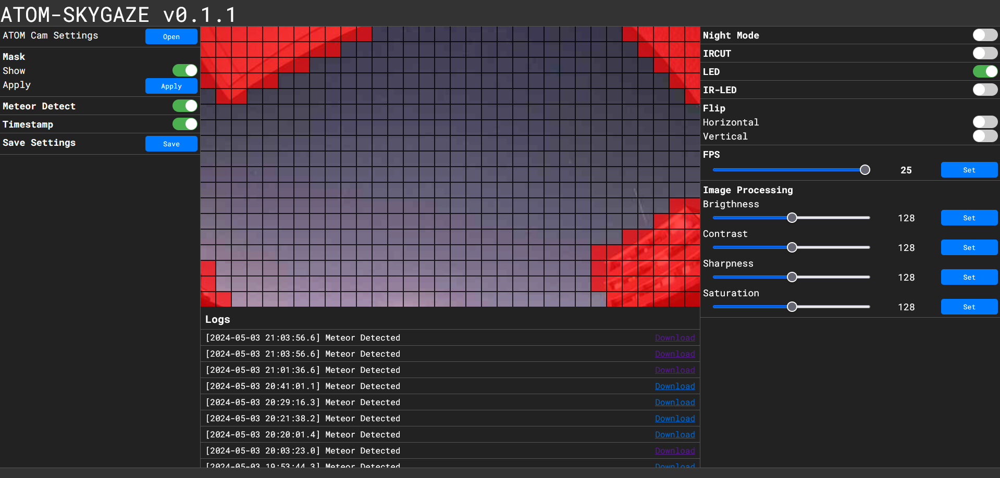

  
  

[English](./README.md)

# ATOM-SKYGAZE
ATOM Cam2で流星観測をするためのハックです。 
[atomcam_tools](https://github.com/mnakada/atomcam_tools)、[meteor_detect](https://github.com/kin-hasegawa/meteor-detect)をもとにしたプロジェクトです。

# WebUIサンプル
## デフォルト

## マスク編集画面

## 検出動画

# 機能
 - ファイル
    - [ ] SSH
    - [ ] FTP
 - 記録
    - レギュラー
      - タイムスタンプ付きの映像がmp4として保存されます。
    - 流星検出
      - NV12フォーマットの画像がfits、jpegとして保存されます。
  - 流星検出
 - WebUI

# 使用方法
ATOM Tech純正アプリで一度WiFiに接続したのち、factory_t31_ZMC6tiIDQNとrootfs_hack.squashfsを入れたMicroSDを挿入し起動。

起動後、LEDランプが青・オレンジ色の点滅をしたら、[http://atomskygaze.local](http://atomskygaze.local)から設定画面に入れます。

# サポート
Issue、Pull Requestなどご自由に立てていただいて構いません。
作者 [tetsu](https://github.com/360tetsu360) は学業のため、リアクションは遅くなります。[Twitter(現X)](https://twitter.com/tmmgq)にて開発情報を載せるかもしれません。

## 詳細
 - ATOM Cam2
   - CPU: Ingenic T31 (mipsel)
   - Image sensor: gc2053
   - ISVP-SDK: 1.1.6
 - Buildroot: 2024.02
 - OpenCV4 + contrib

検出アルゴリズムは[こちら](./algorithm.md)を参照してください。
