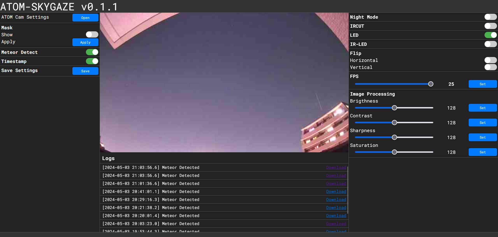

  
  

# ATOM-SKYGAZE
ATOM Cam2で流星観測をするためのハックです。 
[atomcam_tools](https://github.com/mnakada/atomcam_tools)、[meteor_detect](https://github.com/kin-hasegawa/meteor-detect)をもとにしたプロジェクトです。

# WebUIサンプル
## デフォルト

## マスク編集画面

## 検出動画

# 機能
 - ファイル
    - [x] SSH
    - [ ] FTP
 - 録画
    - エンコード (H265 VBR)
      - [x] 純正アプリより高画質な録画
    - タイムスタンプ 
      - [x] 0.1秒まで表示
 - 流星検知
    - 検知範囲
      - [x] 画像を32x18の領域に分け、動体がある部分のみ流星検知
    - マスク
      - [x] 32x18の領域のうち検出しない領域をWebUIで簡単に設定
    - 保存
      - [x] 検知した時間をmicroSD配下のmeteor_log.txtに保存
      - [ ] RAW画像を取得しFITSで保存
 - WebUI
 - Webhook
   - Discord
     - [ ] Discordのメッセージチャンネルに検出ログを送信

# 使用方法
ATOM Tech純正アプリで一度WiFiに接続したのち、factory_t31_ZMC6tiIDQNとrootfs_hack.squashfsを入れたMicroSDを挿入し起動。

起動後、LEDランプが青・オレンジ色の点滅をしたら、[http://atomskygaze.local](http://atomskygaze.local)から設定画面に入れます。

# ビルド
[build-ja.md](./build-ja.md)をご覧ください。

# サポート
Issue、Pull Requestなどご自由に立てていただいて構いません。
作者 [tetsu](https://github.com/360tetsu360) は学業のため、リアクションは遅くなります。[Twitter(現X)](https://twitter.com/tmmgq)にて開発情報を載せるかもしれません。

## 詳細
 - ATOM Cam2
   - CPU: Ingenic T31 (mipsel)
   - Image sensor: gc2053
   - ISVP-SDK: 1.1.6
 - Buildroot: 2024.02
 - OpenCV4 + contrib

検出アルゴリズムは[こちら](./algorithm.md)を参照してください。
## TODO
- [ ] RAW画像保存
- [ ] FITSファイル保存
- [ ] RTSPサーバー
- [ ] Better UI
- [ ] タイムラプス
