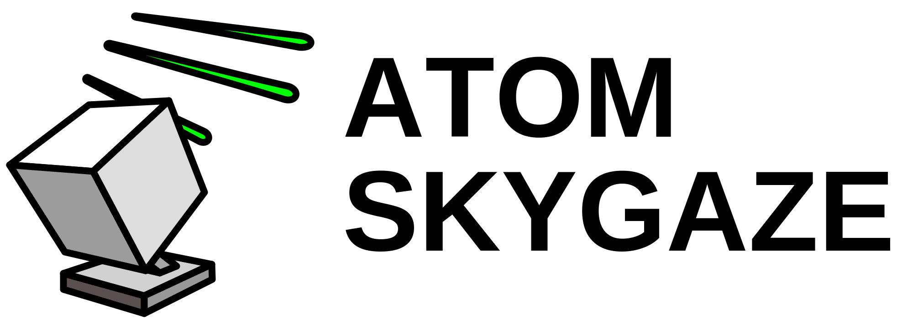
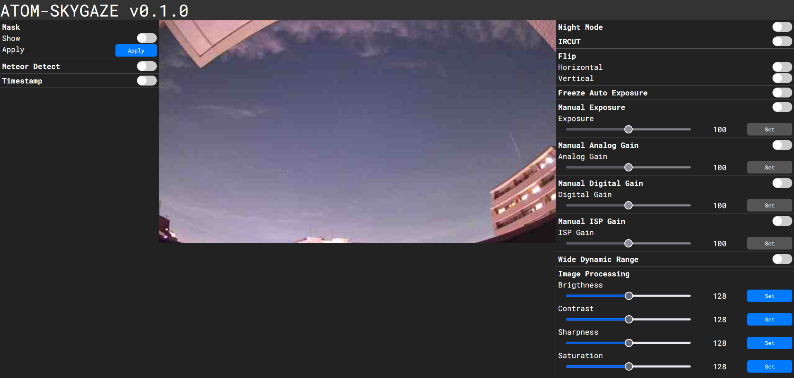
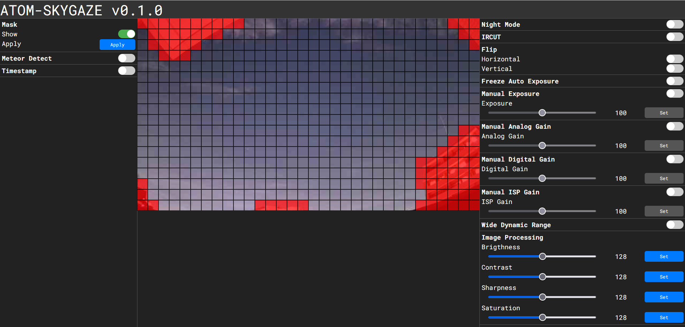
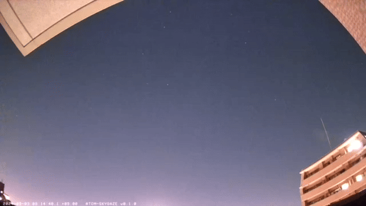

  
  

[日本語](./README-ja.md)

# ATOM-SKYGAZE
This project is a hack to detect meteors with stand-alone ATOM Cam2, based on [atomcam_tools](https://github.com/mnakada/atomcam_tools) and [meteor_detect](https://github.com/kin-hasegawa/meteor-detect).

# WebUI Samples
## Default

## Mask editor

## Detected video

# Features
 - File handling
    - [ ] SSH
    - [ ] FTP
 - Records
    - Regular
      - Video with timestamp, saved as mp4.
    - Detected
      - NV12 format saved as fits and jpeg.
 - Meteor Detection
 - WebUI

# Usage

## Install
After connecting the ATOM Cam2 to Wi-Fi using the regular ATOM Tech app, insert the MicroSD containing factory_t31_ZMC6tiIDQN and rootfs_hack.squashfs.

## Run
After start-up, when the LED lamp flashes blue/orange, you can enter the configuration screen via [http://atomskygaze.local](http://atomskygaze.local).

# Support
You are free to make Issues, Pull Requests.
